# 🛡️ Relatório de Pentest: Do Reconhecimento à Exploração (FTP, Web & SMB)

> **Desafio de Projeto DIO:** Implementação de auditoria de segurança prática utilizando Kali Linux, Medusa e ferramentas de enumeração.

## 📋 Resumo do Projeto
Este relatório documenta a simulação de testes de intrusão (Pentest) em um ambiente controlado. O objetivo foi identificar vulnerabilidades, realizar ataques de força bruta e explorar falhas de configuração em serviços de rede e aplicações web.

---

## ⚙️ 1. Preparação do Ambiente
O laboratório foi montado utilizando o VirtualBox com rede em modo **Host-Only** para isolamento.
* **Atacante:** Kali Linux
* **Alvo:** Metasploitable 2

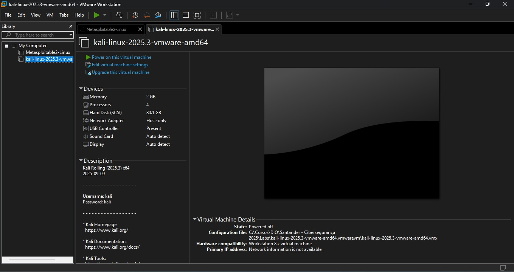

Validamos a comunicação entre as máquinas antes de iniciar os testes.
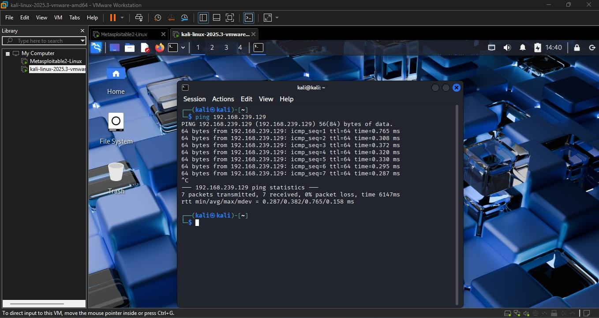

---

## 🔍 2. Reconhecimento (Scanning)
Utilizamos o **Nmap** para mapear a superfície de ataque.
**Comando:** `nmap -sV -p 21,22,80,445,139 192.168.239.129`

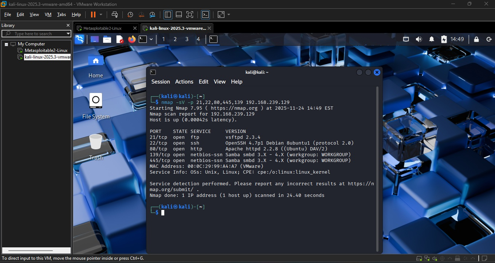
> **Descoberta:** Portas abertas para FTP (21), HTTP (80) e SMB (139/445).

---

## ⚔️ 3. Vetor de Ataque 1: FTP (Porta 21)

### Preparação
Criamos wordlists iniciais simples para testar credenciais padrão.
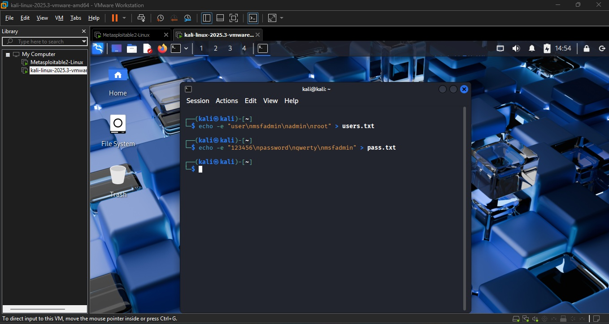

### Execução (Brute Force)
Utilizamos o **Medusa** para testar as senhas contra o serviço FTP.
**Comando:** `medusa -h 192.168.239.129 -U users.txt -P pass.txt -M ftp -t 6`

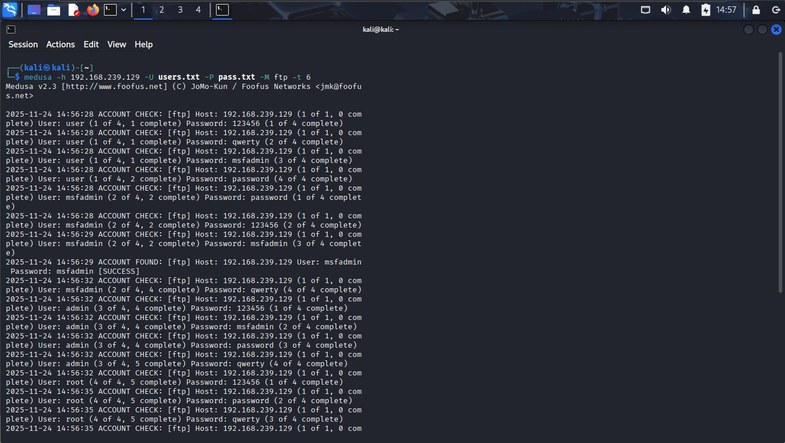

### Validação
Confirmamos o acesso logando no servidor FTP com a credencial encontrada (`msfadmin`).
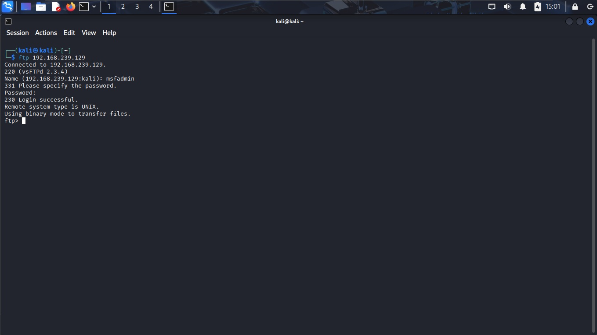

---

## 🌐 4. Vetor de Ataque 2: Aplicação Web (DVWA)

### Análise
No navegador, analisamos a requisição de login (POST) para entender os campos necessários.
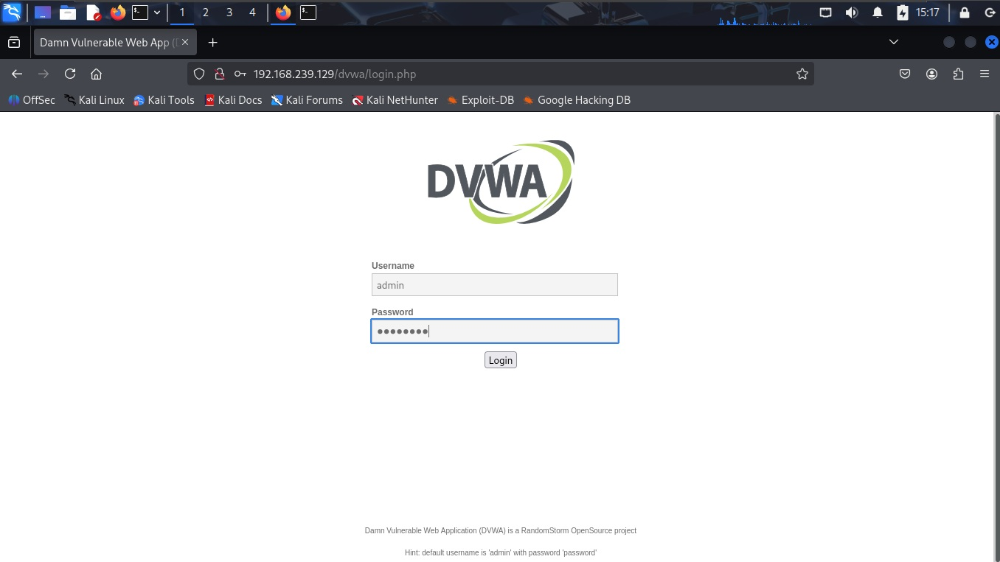
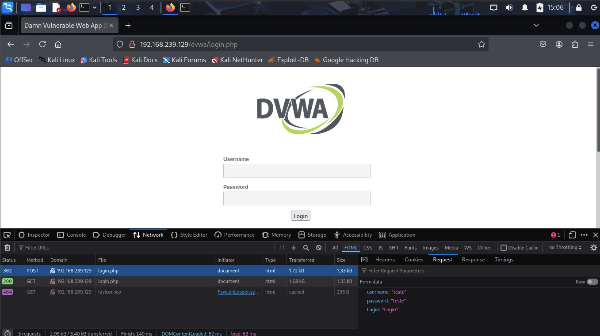

### Execução (Automação)
Utilizamos o **Hydra** para testar combinações de senha no formulário HTML.
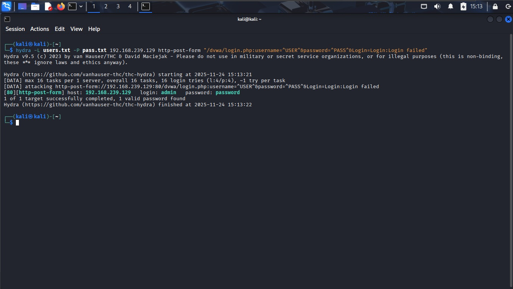

### Validação
Acesso administrativo concedido ao painel do DVWA.
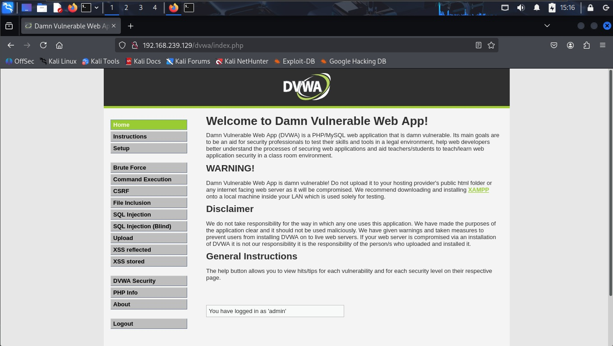

---

## 🏢 5. Vetor de Ataque 3: SMB/Samba (Porta 445)

### Enumeração (Enumeration)
Para este serviço, utilizamos o **Enum4Linux** para descobrir nomes de usuários válidos no sistema e informações do domínio.
**Comando:** `enum4linux -a 192.168.239.129`

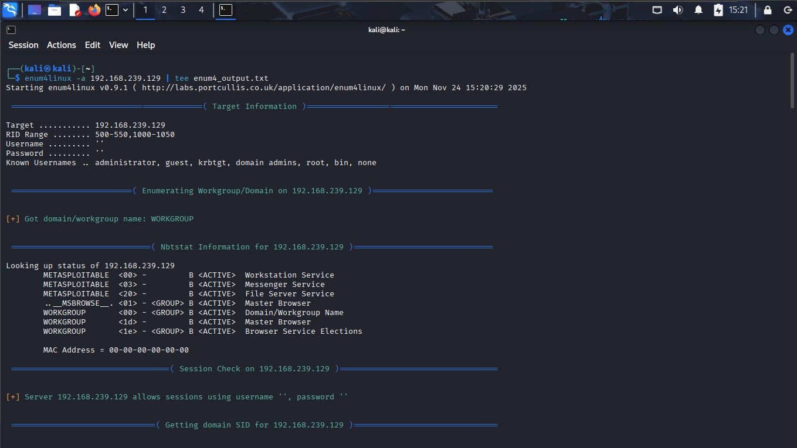
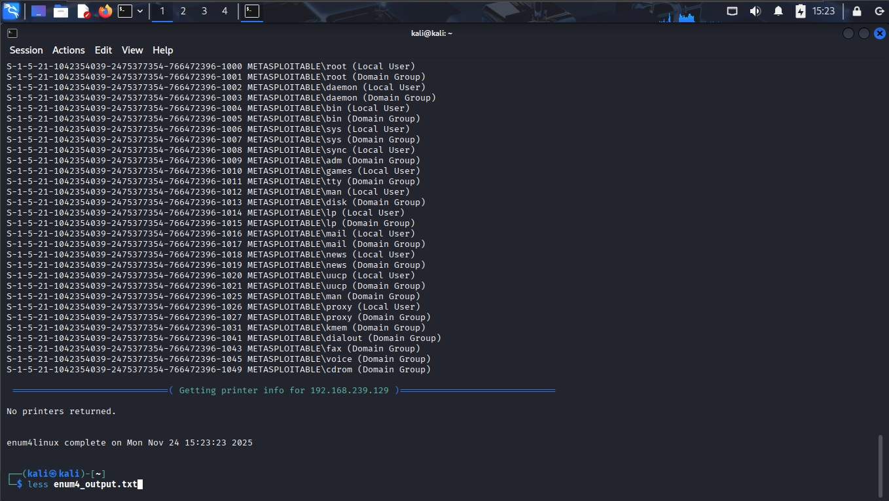

O comando listou diversos usuários locais:
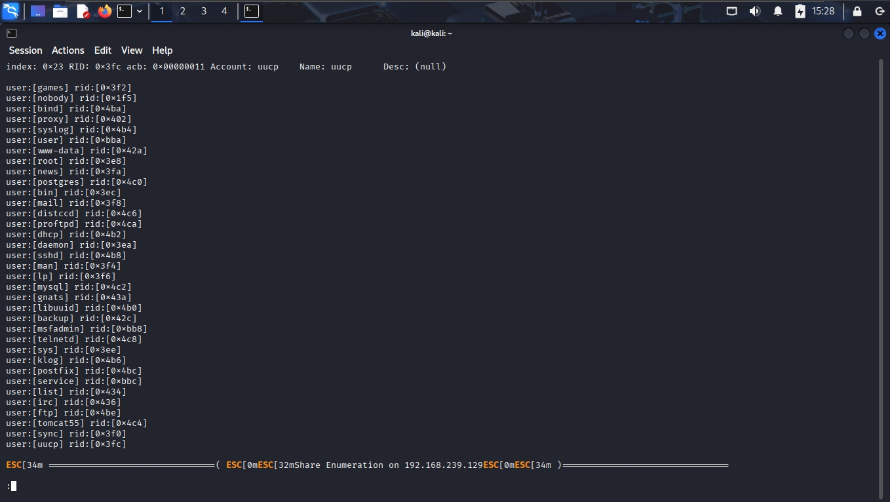

### Password Spraying
Com os usuários enumerados, criamos uma nova lista específica e realizamos um ataque de *Password Spraying* (tentar poucas senhas em muitos usuários).
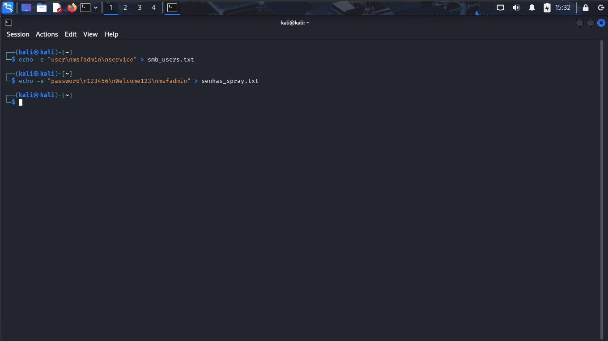

Utilizamos o módulo `smbnt` do Medusa:
**Comando:** `medusa -M smbnt -U smb_users.txt -P senhas_spray.txt ...`

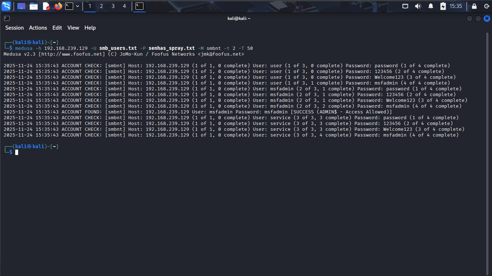

### Validação
Conectamos via **smbclient** para listar os compartilhamentos disponíveis.
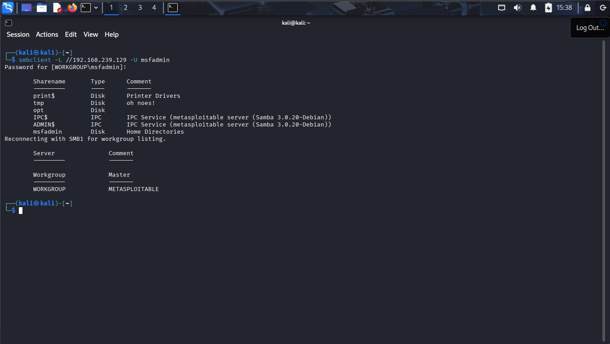

---

## 🛡️ Medidas de Mitigação
1.  **Bloqueio de Enumeração:** Configurar o Samba para não permitir conexões anônimas ou listagem de usuários (Restrict Anonymous).
2.  **Senhas Fortes:** Política de senhas complexas impediria os ataques de dicionário realizados.
3.  **Monitoramento:** Alertas para múltiplas falhas de login (Brute Force) em curto período.

---
*Projeto realizado para fins educacionais.*
